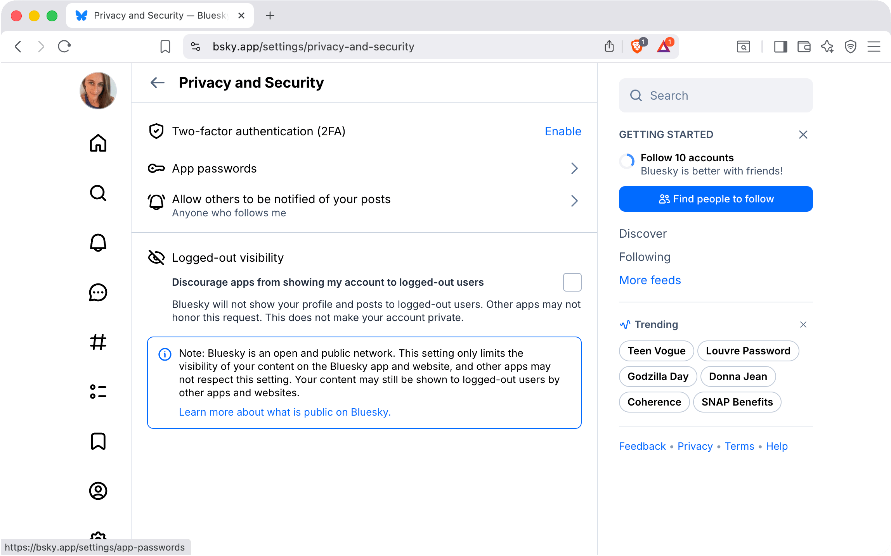
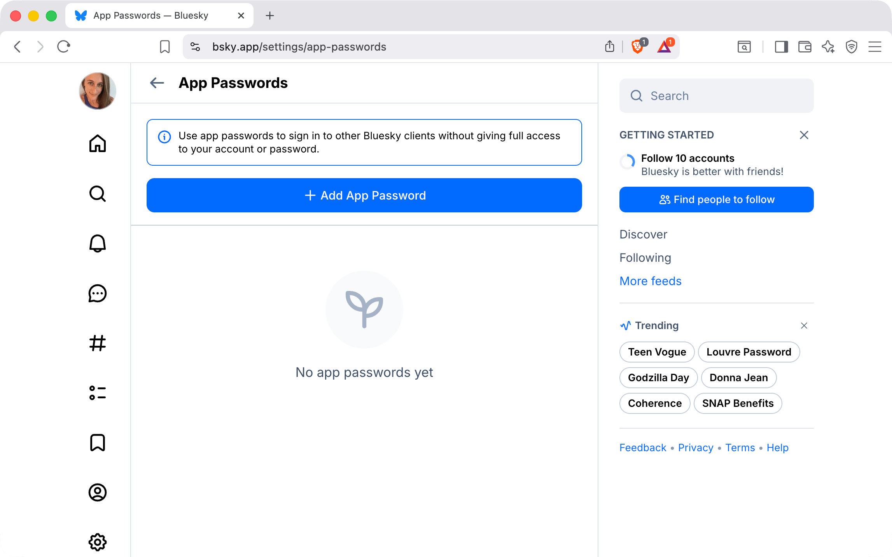
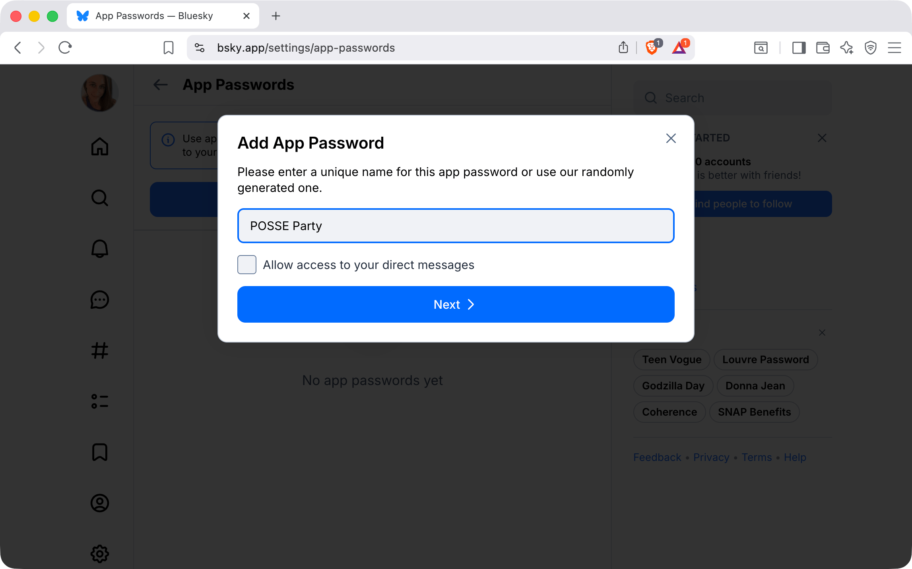
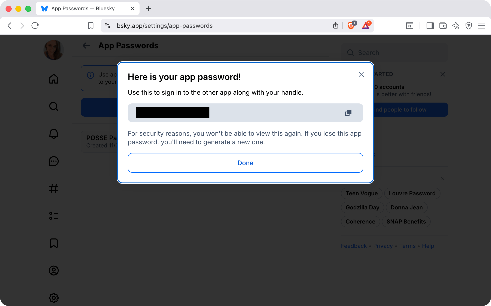
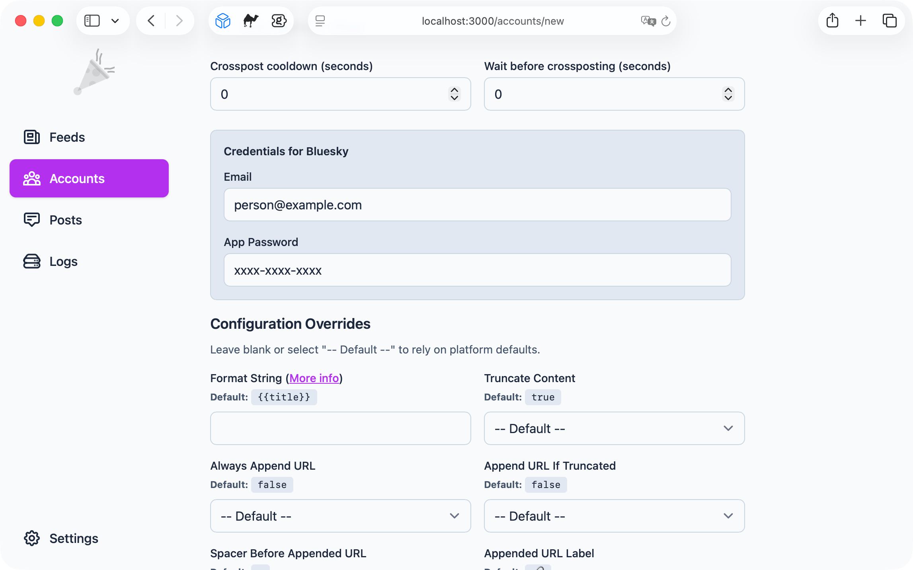

# Bluesky Account Setup

This guide walks through connecting your Bluesky account to POSSE Party so it can publish posts on your behalf.

## What POSSE Party Needs From You

- `Email` address for your Bluesky account
- `App Password` generated in your Bluesky account settings (POSSE Party uses this instead of your main password)

## How to Set Up Your Account

1. [Open Bluesky security settings](#1-open-bluesky-security-settings)
2. [Create an app password](#2-create-an-app-password)
3. [Copy your app password](#3-copy-your-app-password)
4. [Add Bluesky to POSSE Party](#4-add-bluesky-to-posse-party)

### 1. Open Bluesky Security Settings

1. Sign in to Bluesky in a browser.
2. Open **Settings → Privacy & security**, or go directly to `https://bsky.app/settings/privacy-and-security`.
3. Scroll to the **App passwords** section.

Click **App passwords**.

### 2. Create an App Password

Click **Add app password**.

Give the app password a name like `POSSE Party`, then click **Next**.

### 3. Copy Your App Password

Bluesky will display a one-time app password.

Copy this app password and store it somewhere safe. You will not be able to view it again later.

### 4. Add Bluesky to POSSE Party

In POSSE Party, add a new Bluesky account:

1. Set `Email` to the email address you use with Bluesky
2. Set `App Password` to the app password you just generated
3. Save the account

Once saved, POSSE Party will be able to publish crossposts to your Bluesky account using your Atom feed and account settings.

