# LinkedIn Account Setup

This guide walks through connecting your LinkedIn account to POSSE Party so it can publish posts on your behalf.

## What POSSE Party Needs From You

- `Client ID`
- `Client Secret`
- `Access Token`
- `Person URN` (a value like `urn:li:person:abcd1234` that identifies your LinkedIn profile)

All four values come from your LinkedIn developer app and the LinkedIn API.

## How to Set Up Your Account

1. [Create a LinkedIn app](#1-create-a-linkedin-app)
2. [Request access to “Share on LinkedIn”](#2-request-access-to-share-on-linkedin)
3. [Configure OAuth settings and redirect URL](#3-configure-oauth-settings-and-redirect-url)
4. [Generate an access token](#4-generate-an-access-token)
5. [Look up your Person URN](#5-look-up-your-person-urn)
6. [Add LinkedIn to POSSE Party](#6-add-linkedin-to-posse-party)

### 1. Create a LinkedIn App

1. Visit [https://developer.linkedin.com/](https://developer.linkedin.com/) and sign in with your LinkedIn account and click **Create app**.

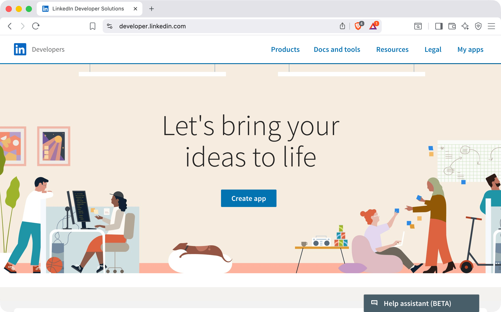

2. Fill out the app details and then click **Create app**
    - App name (for example, `POSSE Party`)
    - Company Page to associate with the app (this is **required**, create one if needed)
    - App logo
    - Accept LinkedIn’s terms


### 2. Request Access to “Share on LinkedIn”

1. On your app’s overview page, find the **Share on LinkedIn** product and click **Request Access**.

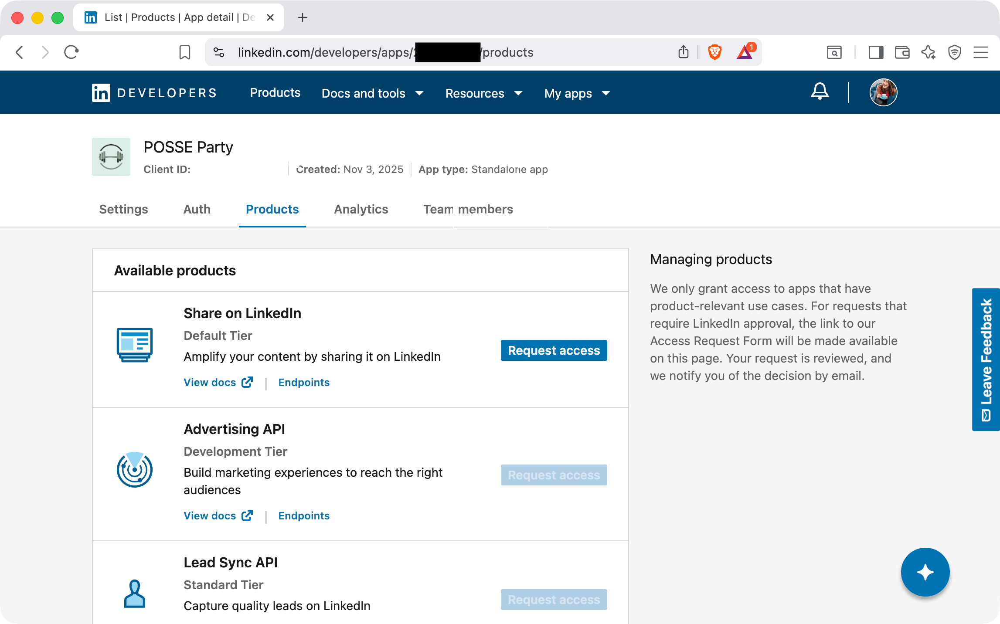

2. Agree to the product’s terms to enable posting via the API.

3. Scroll to the **Sign in with LinkedIn OpenID Connect** section and click **Request access**.

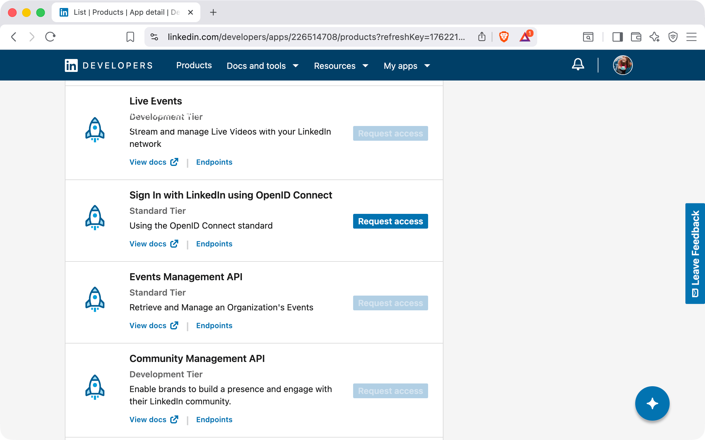

4. Agree to the terms and click **Request access**

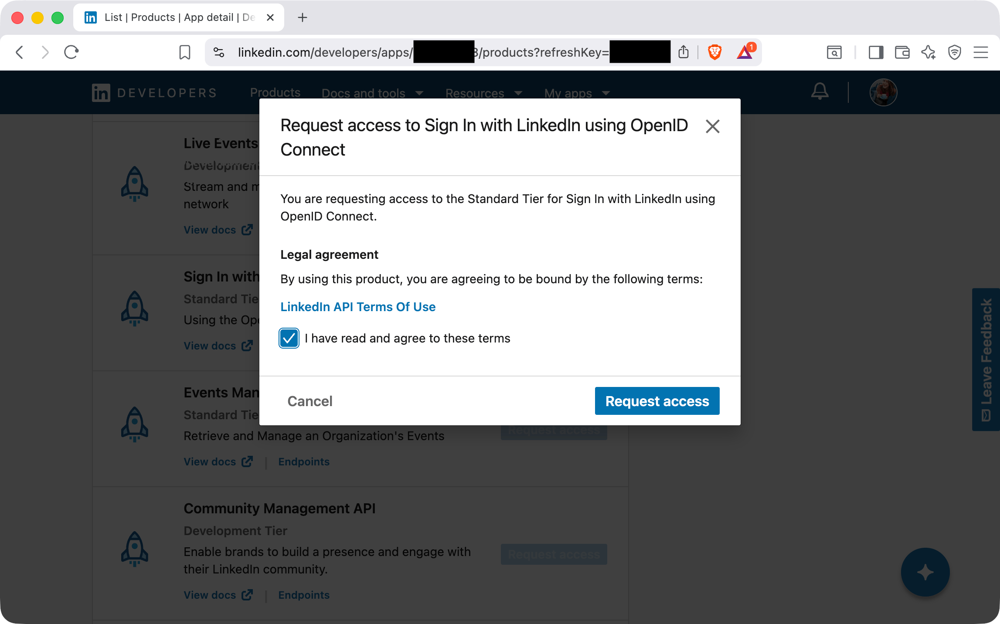

### 3. Configure OAuth Settings and Redirect URL


1. Once your app is provisioned, navigate to the **Auth** tab and take note of your **Client ID** and **Client Secret**.

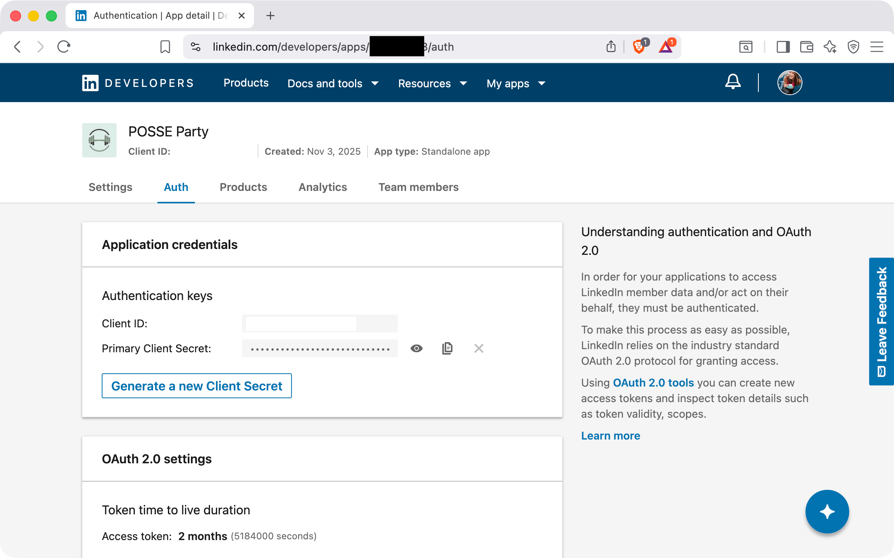

2. Scroll down to **OAuth 2.0 settings** and click the pencil icon next to **Authorized redirect URLs for your app**


3. Add the LinkedIn OAuth callback URL for your POSSE Party instance. This will be `https://YOUR_IP_OR_DOMAIN/credential_renewals/linkedin` (replace the protocol and host with whatever the public URL of your instance is). Click **Update** to save.

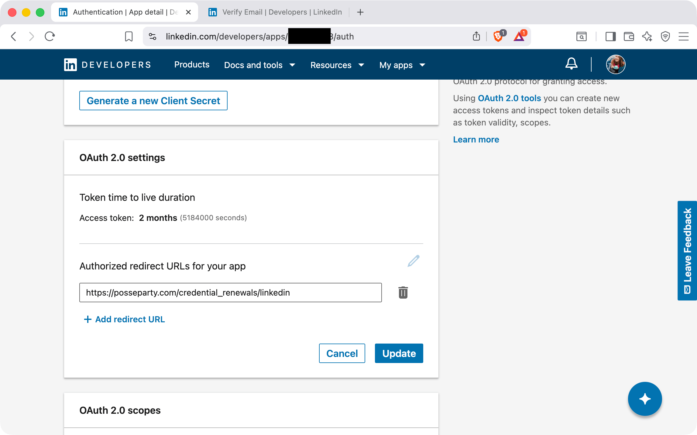

### 4. Generate an Access Token

1. Back on the **Auth tab**, click the link **OAuth 2.0 tools** in the right-hand sidebar.


2. Click **Create token**.

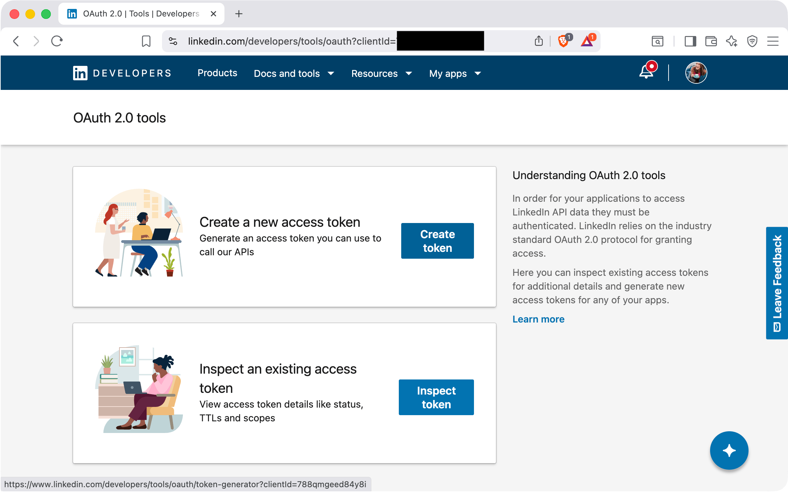

3. Select the scopes:
    - `openid`
    - `profile`
    - `w_member_social`

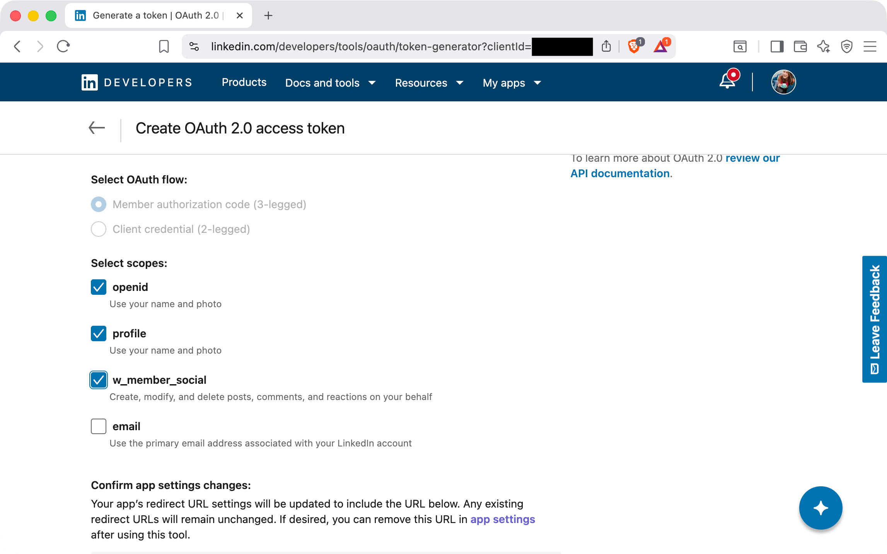

4. Scroll down and check **I understand this tool…**, then click **Request access token**.

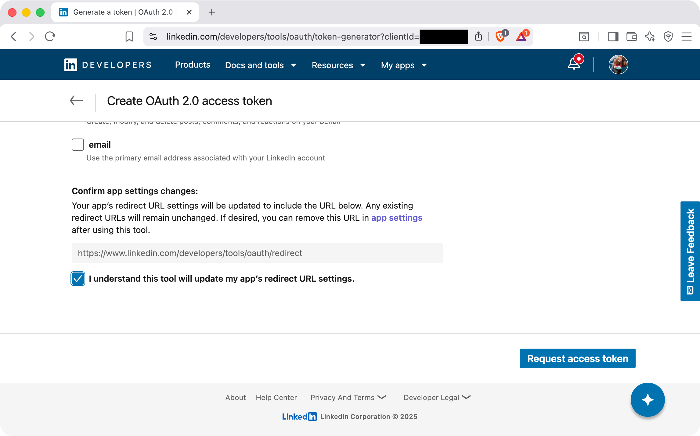

5. Log in when prompted to authorize the app. LinkedIn will generate an **Access Token**.

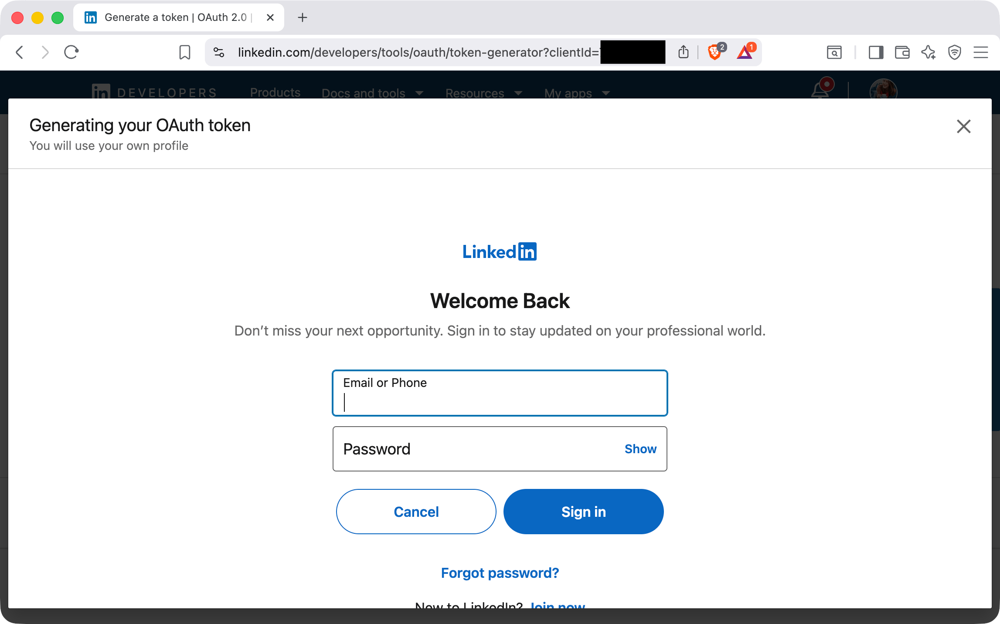

6. Copy and take note of the resulting **Access token**. POSSE Party will use it to publish on your behalf until it expires.


### 5. Look Up Your Person URN

POSSE Party also needs your **Person URN** to post as your profile. You can look it up using the access token you just generated.

1. In a terminal, export your access token:

```bash
export ACCESS_TOKEN="PASTE YOUR ACCESS TOKEN HERE"
```

2. Call the LinkedIn `userinfo` endpoint with the `curl` command:

```bash
curl -X GET "https://api.linkedin.com/v2/userinfo" \
  -H "Authorization: Bearer $ACCESS_TOKEN" \
  -H "X-Restli-Protocol-Version: 2.0.0"
```

3. The response will look something like:

```json
{
  "name": "Jane Doe",
  "sub": "abcd1234",
  "locale": {"country": "US", "language": "en"},
  "given_name": "Jane",
  "family_name": "Doe",
  "picture": "https://media.licdn.com/..."
}
```

In this example, the **Person URN** is built by taking the fixed prefix `urn:li:person:` and appending the value of `sub` in the above JSON object. In this example, Jane Does' Person URN would be `urn:li:person:abcd1234`.


### 6. Add LinkedIn to POSSE Party

1. In POSSE Party, go to **Accounts** and click **Add Account**. Give the account a label and select **LinkedIn** as the platform.

2. Under **Credentials for LinkedIn**, fill:
    - `Client ID`
    - `Client Secret`
    - `Access Token`
    - `Person URN`

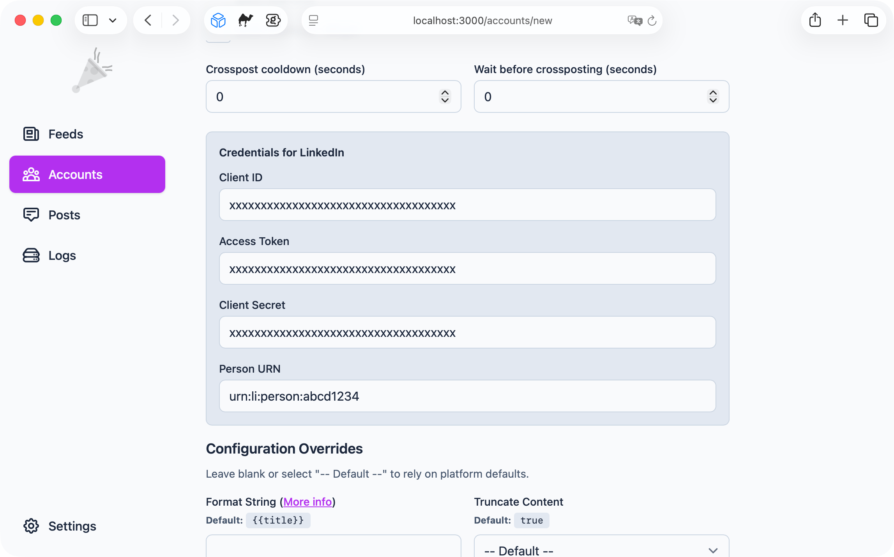

Once saved, POSSE Party will be able to publish crossposts to your LinkedIn account using your site's feed and account settings, and will remind you via e-mail and the **Logs** page when it is time to renew your LinkedIn access token.
