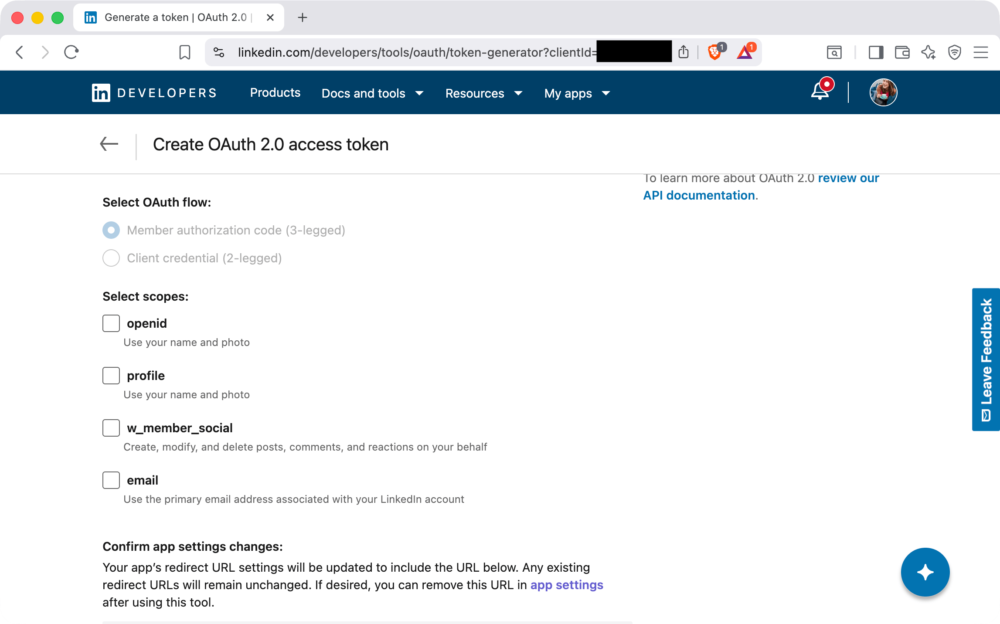

# LinkedIn Account Setup

This guide walks through connecting your LinkedIn account to POSSE Party so it can publish posts on your behalf.

## What POSSE Party Needs From You

- `Client ID`
- `Client Secret`
- `Access Token`
- `Person URN` (a value like `urn:li:person:abcd1234` that identifies your LinkedIn profile)

All four values come from your LinkedIn developer app and the LinkedIn API.

## How to Set Up Your Account

1. [Create a LinkedIn app](#1-create-a-linkedin-app)
2. [Request access to “Share on LinkedIn”](#2-request-access-to-share-on-linkedin)
3. [Configure OAuth settings and redirect URL](#3-configure-oauth-settings-and-redirect-url)
4. [Generate an access token](#4-generate-an-access-token)
5. [Look up your Person URN](#5-look-up-your-person-urn)
6. [Add LinkedIn to POSSE Party](#6-add-linkedin-to-posse-party)

### 1. Create a LinkedIn App

1. Visit `https://developer.linkedin.com/` and sign in with your LinkedIn account.
2. Click **Create app**.


3. Fill out the app details:

   - App name (for example, `POSSE Party`)
   - Company Page to associate with the app (create one if needed)
   - App logo
   - Accept LinkedIn’s terms

4. Click **Create app**.


### 2. Request Access to “Share on LinkedIn”

1. On your app’s overview page, find the **Share on LinkedIn** product and click **Request Access**.


2. Agree to the product’s terms to enable posting via the API.

3. If prompted, scroll to **Sign in with LinkedIn OpenID Connect** and follow the prompts to verify an email address and finish provisioning.


### 3. Configure OAuth Settings and Redirect URL

Once your app is provisioned:

1. Go to the **Auth** tab for your app.


2. Copy and save your **Client ID** and **Client Secret**. POSSE Party uses these when renewing your token.

3. Scroll down to **OAuth 2.0 settings**.


4. Next to **Authorized redirect URLs for your app**, click the pencil icon to edit.


5. Add the POSSE Party LinkedIn renewal URL for your instance. For example:

`https://your-posse-party-host/credential_renewals/linkedin`

If you are running the default hosted domain, that might look like:

`https://posseparty.com/credential_renewals/linkedin`

This URL is important because LinkedIn access tokens must be renewed manually via OAuth every two months. POSSE Party will send you e-mail reminders and link you back to this URL.

6. Click **Update** to save.


### 4. Generate an Access Token

1. On the right-hand sidebar, click **OAuth 2.0 tools**.


2. Click **Create token**.



3. Select the scopes:

   - `openid`
   - `profile`
   - `w_member_social`


4. Acknowledge that this tool will add its redirect URL to your app’s list of redirect URLs, then click **Request access token**.


5. Log in if prompted and authorize the app. LinkedIn will generate an **Access Token**.


Copy and save this access token; POSSE Party will use it to publish on your behalf until it expires.

### 5. Look Up Your Person URN

POSSE Party also needs your **Person URN** to post as your profile. You can look it up using the access token you just generated.

1. In a terminal, export your access token:

```bash
export ACCESS_TOKEN="PASTE YOUR ACCESS TOKEN HERE"
```

2. Call the LinkedIn `userinfo` endpoint:

```bash
curl -X GET "https://api.linkedin.com/v2/userinfo" \
  -H "Authorization: Bearer $ACCESS_TOKEN" \
  -H "X-Restli-Protocol-Version: 2.0.0"
```

3. The response will look something like:

```json
{
  "name": "Jane Doe",
  "sub": "abcd1234",
  "locale": {"country": "US", "language": "en"},
  "given_name": "Jane",
  "family_name": "Doe",
  "picture": "https://media.licdn.com/..."
}
```

In this example, the **Person URN** is built by taking the fixed prefix `urn:li:person:` and appending the `sub` value, resulting in:

`urn:li:person:abcd1234`


### 6. Add LinkedIn to POSSE Party

In POSSE Party, add a new LinkedIn account:

1. Set `Client ID` to your LinkedIn app client ID
2. Set `Client Secret` to your LinkedIn app client secret
3. Set `Access Token` to the access token generated from the OAuth 2.0 tools
4. Set `Person URN` to the `urn:li:person:...` value you derived from the `userinfo` API
5. Save the account

Once saved, POSSE Party will be able to publish crossposts to your LinkedIn account using your Atom feed and account settings, and will remind you via e-mail when it is time to renew your LinkedIn access token.
