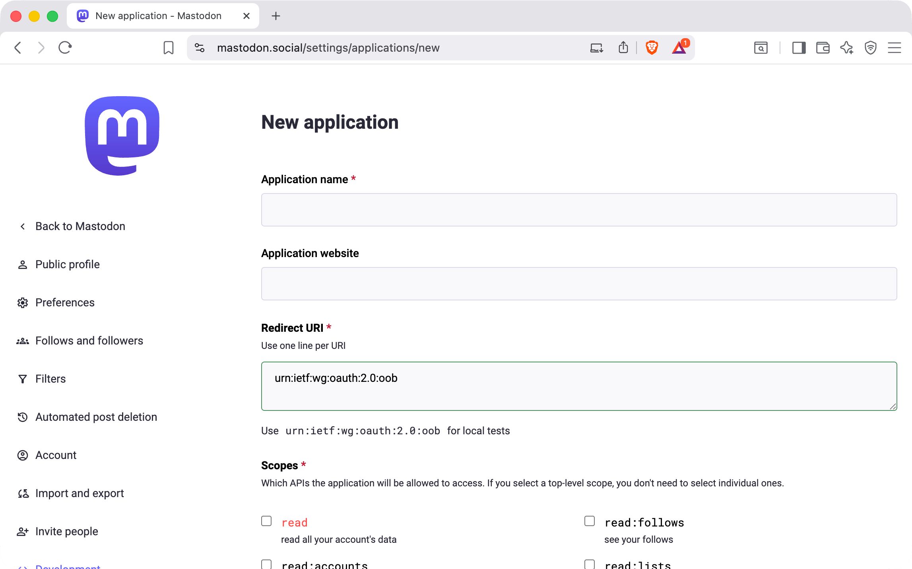

# Mastodon Account Setup

This guide walks through connecting your Mastodon account to POSSE Party so it can publish posts on your behalf.

## What POSSE Party Needs From You

- `Base URL` for your Mastodon instance, for example `https://mastodon.social`
- `Access Token` that authorizes POSSE Party to publish posts to your account via the Mastodon API

## How to Set Up Your Account

1. [Create a new application in Mastodon](#1-create-a-new-application-in-mastodon)
2. [Configure permissions for POSSE Party](#2-configure-permissions-for-posse-party)
3. [Copy your access token](#3-copy-your-access-token)
4. [Add Mastodon to POSSE Party](#4-add-mastodon-to-posse-party)

### 1. Create a New Application in Mastodon

1. Sign in to your Mastodon account in a browser.
2. Open your account’s application settings, usually at a URL like `https://your-instance.example/settings/applications`.
3. Click **New application**.

On the new application form:

- Choose a clear name like `POSSE Party`
- Optionally provide your site URL (for example, `https://posseparty.com`)

### 2. Configure Permissions for POSSE Party

In the **Scopes** or **Permissions** section of the application form:

- Keep **Profile** checked
- Check **write:statuses** so POSSE Party can publish posts on your behalf

Save the application.

### 3. Copy Your Access Token

After saving, open the application you just created. Mastodon will display:

- Client key
- Client secret
- Access token

POSSE Party only needs the **Access token** value for your account.

### 4. Add Mastodon to POSSE Party

In POSSE Party, add a new Mastodon account:

1. Set `Base URL` to your Mastodon instance URL (for example, `https://mastodon.social` or your self-hosted domain)
2. Paste your personal `Access Token` from Mastodon
3. Save the account

Once saved, POSSE Party will be able to publish crossposts to your Mastodon account using your Atom feed and account settings.

