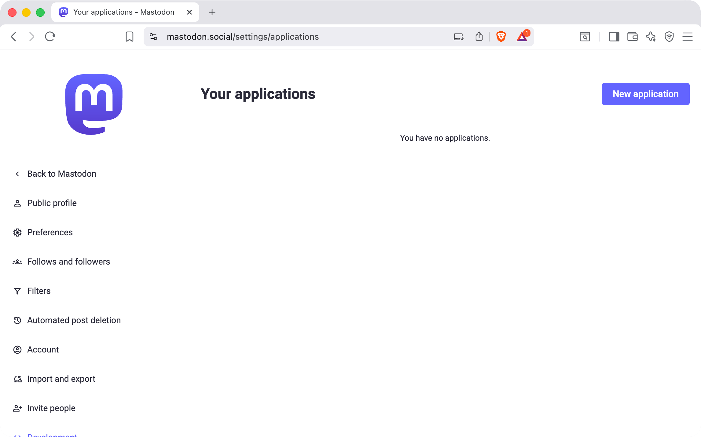
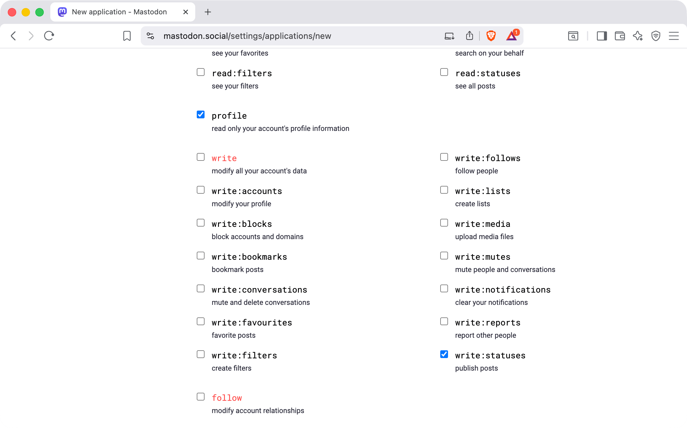
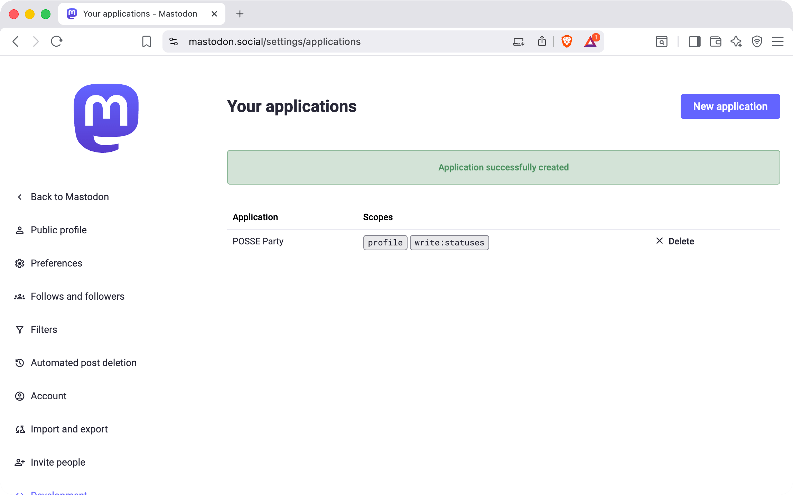
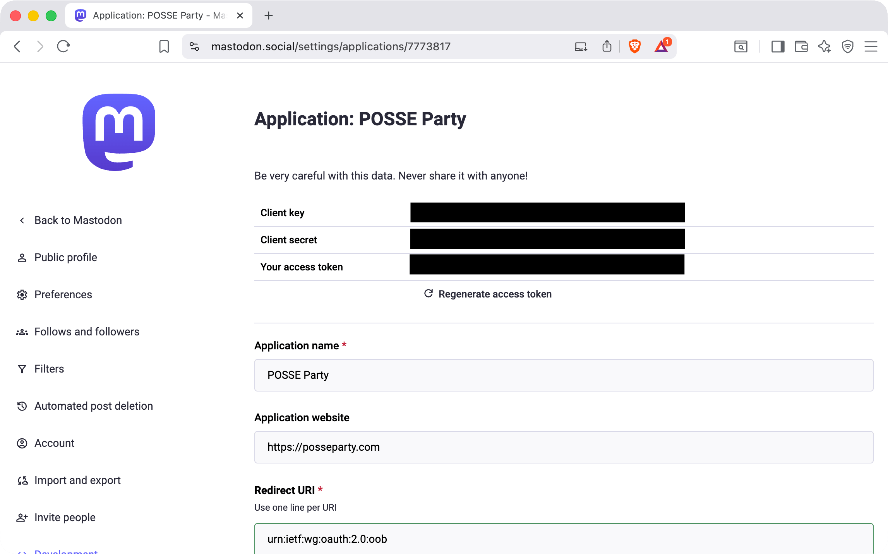
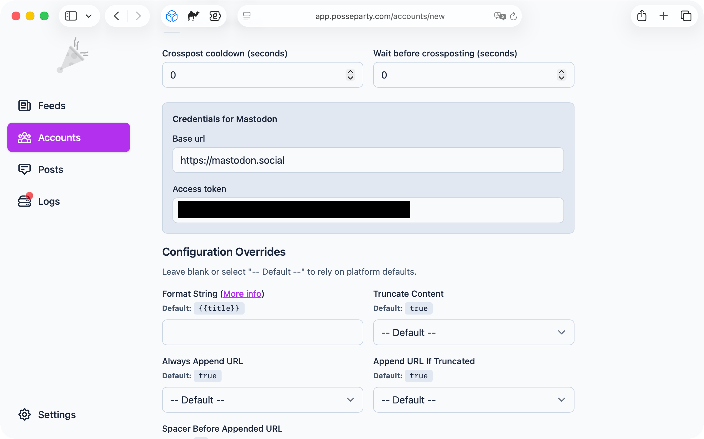

# Mastodon Account Setup

This guide walks through connecting your Mastodon account to POSSE Party so it can publish posts on your behalf.

## What POSSE Party Needs From You

- `Base URL` for your Mastodon instance, for example `https://mastodon.social`
- `Access Token` that authorizes POSSE Party to publish posts to your account via the Mastodon API

## How to Set Up Your Account

1. [Create a new application in Mastodon](#1-create-a-new-application-in-mastodon)
2. [Add Mastodon to POSSE Party](#2-add-mastodon-to-posse-party)

### 1. Create a New Application in Mastodon

1. In your Mastodon account's settings, click `Development` from the sidebar to open your application settings. Then click **New application**.

2. Provide a name and the URL to your POSSE Party instance

3. Scroll to **Scopes** and—leaving `profile` checked—check `write:statuses` as well. Click **Submit**

4. Once created, click the name of your application (it doesn't look like it, but it's a link)

5. Copy your **Access token** and take note of it

### 2. Add Mastodon to POSSE Party

1. In POSSE Party, go to **Accounts** and click **Add Account**. Give the account a label and select **Mastodon** as the platform.

2. Under **Credentials for Mastodon**, enter:
    - `Base URL` to your Mastodon instance URL (e.g., `https://mastodon.social`)
    - `Access token`

Once saved, POSSE Party will be able to publish crossposts to your Mastodon account using your site's feed and account settings.
