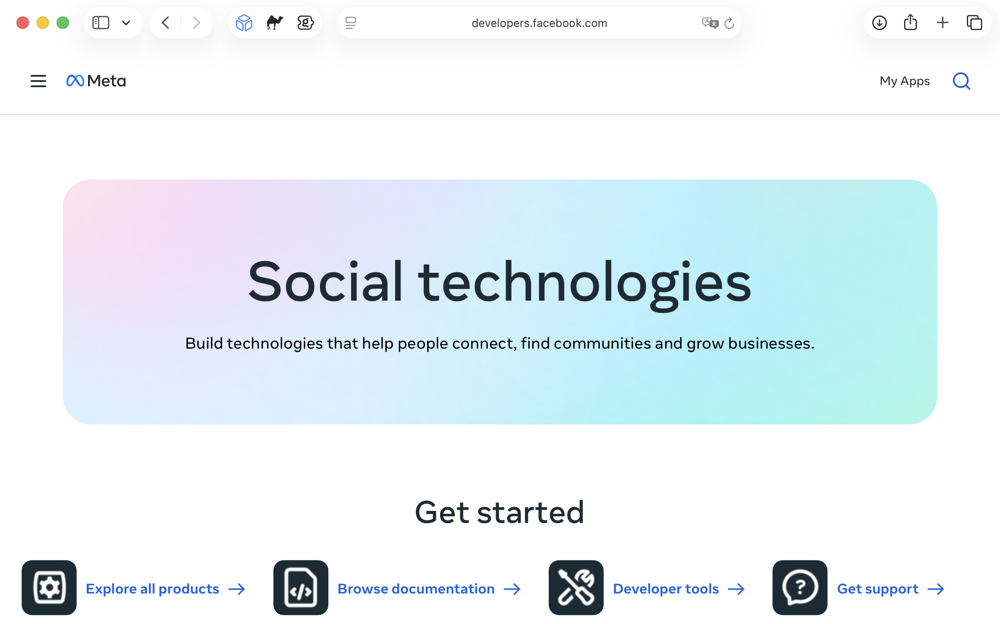
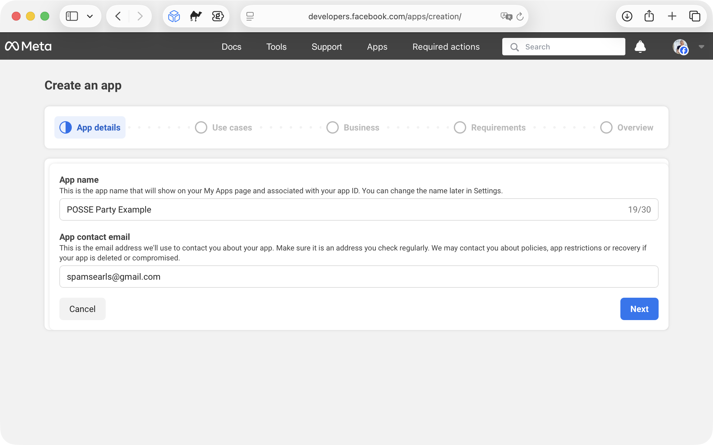
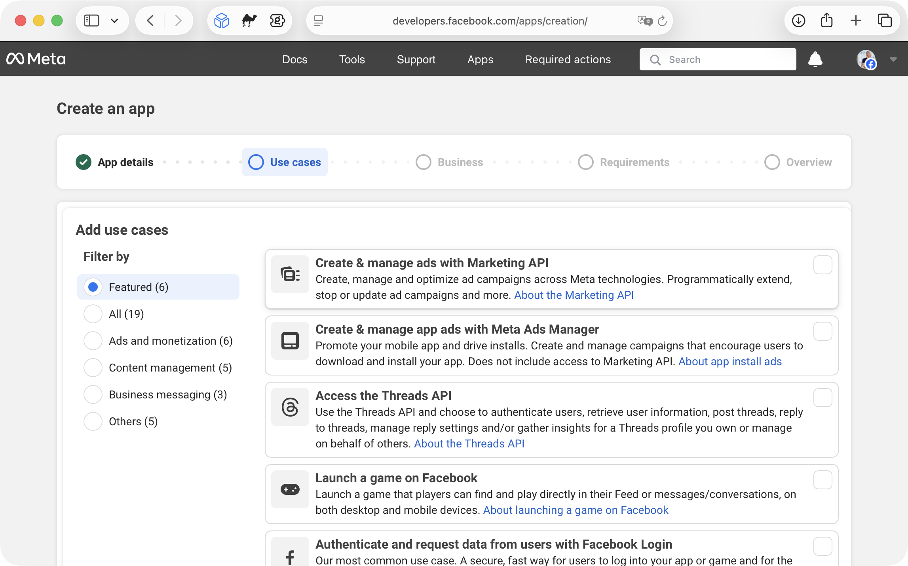
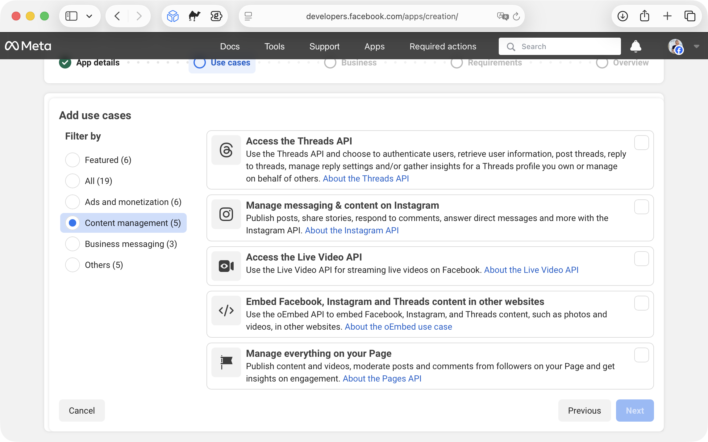
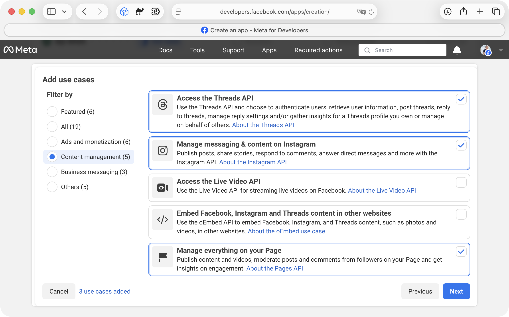
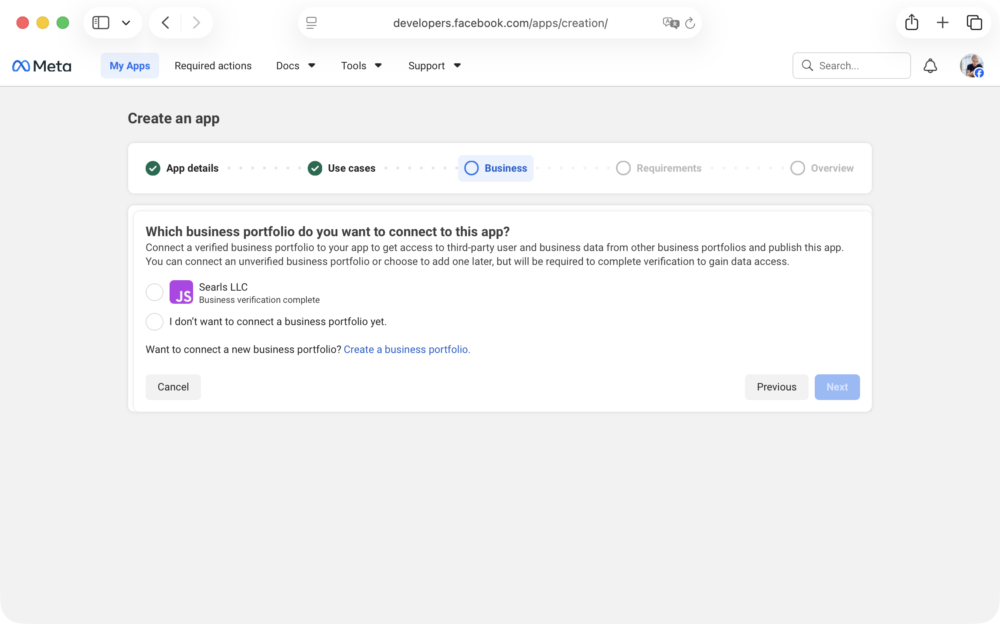
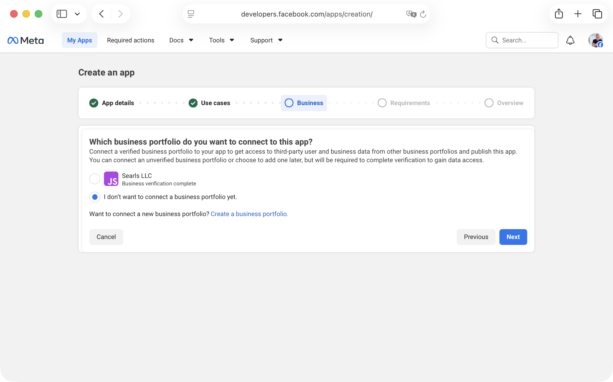
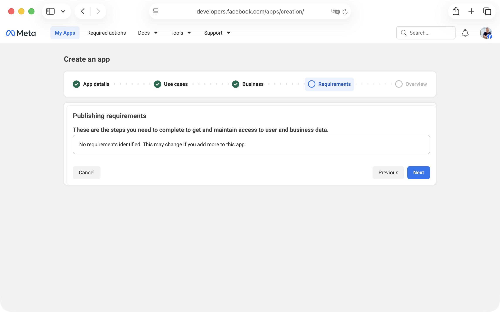
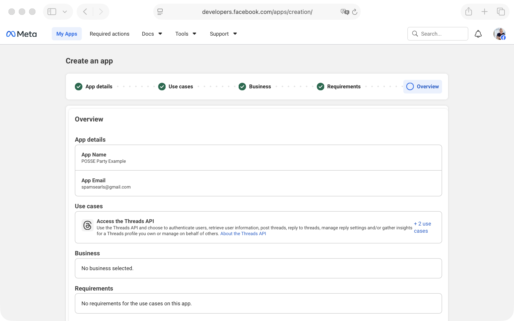
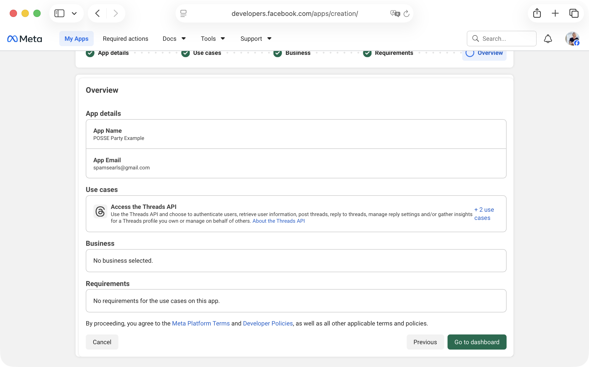

# Meta Developer App Setup

This guide walks through creating a Meta app in the Meta for Developers portal. You’ll do this once, then use that app to connect POSSE Party to [Threads](/docs/account_setup/threads.md), [Instagram](/docs/account_setup/instagram.md), and/or [Facebook Pages](/docs/account_setup/facebook.md).

## What POSSE Party Needs From You

Nothing from this guide alone. You’ll collect platform-specific credentials in the [Threads account setup](/docs/account_setup/threads.md), [Instagram account setup](/docs/account_setup/instagram.md), and [Facebook Pages account setup](/docs/account_setup/facebook.md) guides.

## How to Set Up Your App

1. [Create a new Meta app](#1-create-a-new-meta-app)
2. [Select the use cases you need](#2-select-the-use-cases-you-need)
3. [Finish creation and open the dashboard](#3-finish-creation-and-open-the-dashboard)

### 1. Create a New Meta App

1. Visit `https://developers.facebook.com` and sign in.
2. Click **My Apps**.

3. Click **Create App**.

4. Enter an app name and contact email, then continue.

### 2. Select the Use Cases You Need

1. From the left sidebar, choose **Content management**.

2. For each platform you plan to connect, select the matching use case(s):

- Threads: **Access the Threads API**
- Instagram: **Manage messaging & content on Instagram**
- Facebook Pages: **Manage everything on your Page**

3. Click **Next**.

4. If you don’t have (or don’t want to connect) a business portfolio, choose **I don't want to connect a business portfolio yet**, then click **Next**.

Meta will show a confirmation step after you skip the business portfolio.

5. For these use cases, there are typically no special requirements. Click **Next** to continue.

6. Click the “use cases” link (for example, **+2 use cases**) and confirm you have the three use cases you intended to enable.

### 3. Finish Creation and Open the Dashboard

1. Click **Done** to create the app.

2. Click **Go to dashboard**.

From here, follow the platform setup guide(s) you need:

* [Threads account setup](/docs/account_setup/threads.md)
* [Instagram account setup](/docs/account_setup/instagram.md)
* [Facebook Pages account setup](/docs/account_setup/facebook.md)
